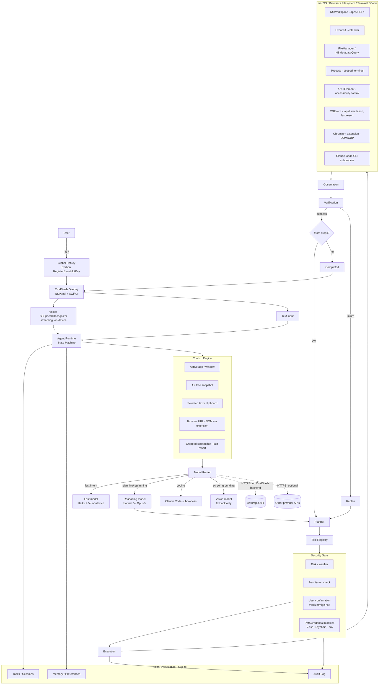

# CmdSlash (`cmd/`) — Product & Systems Architecture Plan

*Status: pre-implementation planning. No production code has been written yet. Repository `mkaavish/cmdslash-priv` exists but is currently empty.*

---

## 1. Executive Summary

CmdSlash is a native macOS agent that turns `⌘/` into a command layer over the entire OS: the user states an outcome (voice or text), and CmdSlash plans, executes, observes, and verifies a sequence of real actions across native apps, the filesystem, the terminal, the browser, and code — using structured system APIs wherever possible and falling back to accessibility/vision/input-simulation only when nothing better exists.

The product only works if three things are simultaneously true: it is **fast** (overlay in <100ms, first action visibly starting in <1s), **trustworthy** (it verifies its own work and never silently fails or silently does something destructive), and **native** (it feels like part of macOS, not a web app in a floating window). Most of this plan is about protecting those three properties against the obvious ways they erode — accessibility-API flakiness, LLM latency, prompt injection, and the temptation to reach for screenshots-and-coordinates because it's easier to prototype.

The recommended posture: **Swift/SwiftUI/AppKit native app, non-sandboxed, Developer ID signed and notarized, distributed outside the Mac App Store**, with a companion Chromium browser extension for structured browser control, and Claude Code (CLI/SDK) shelled out to as the coding-agent backend rather than reimplemented. Cloud LLMs (primarily Anthropic, Claude 5 family) do planning/reasoning; a small fast model or on-device classifier handles trivial intent routing; vision models are a fallback of last resort, not the default sensing mechanism.

## 2. Product Vision

Replace "figure out how to do this in each app" with "say what you want done." The long-term bet is that the atomic unit of computer interaction shifts from *clicks in a specific app* to *outcomes stated to an agent that knows how to operate every app on your behalf*. CmdSlash is the front door to that shift on macOS: a keyboard shortcut away, always available, and disciplined about staying out of the way when it isn't needed.

## 3. Core Differentiation

Not "Spotlight + AI," not "Computer Use in a chat window," not "voice dictation with extra steps." The differentiator is the combination of:

- A **native, sub-100ms activation surface** — nothing else in this category (Claude Computer Use, ChatGPT agents, browser agents) has an OS-level, always-warm entry point.
- **Structured-tool-first execution** — most of what looks like "AI controlling your computer" in demos today is screenshots + synthetic clicks, which is slow and brittle. CmdSlash prefers EventKit over clicking Calendar, filesystem APIs over clicking Finder, a browser extension's DOM over screenshot-guessing a webpage. Vision/coordinates are the last resort, not the mechanism.
- **A real coding agent as a first-class tool**, not a toy. CmdSlash doesn't reimplement code editing — it orchestrates Claude Code (or an equivalent CLI agent) against the user's actual repo, and treats VS Code as a *viewport* the user can watch, not the thing being driven.
- **Verification built into the execution loop**, not bolted on. Every tool call has a defined "how do I know this worked" step, and the agent replans from observed reality, not from assumed success.

## 4. Initial Target User

**Not "everyone."** The wedge is **developers, technical founders, and power users who already trust an AI coding agent (Claude Code, Cursor, Codex) to make real changes to their systems.** This is a deliberate choice: that population already has the trust threshold CmdSlash needs ("let the agent actually do it, not just tell me how"), already lives in the exact cross-app workflows CmdSlash targets (editor + terminal + browser + docs), and is the population where the coding-agent integration — CmdSlash's hardest-to-copy feature — is immediately load-bearing rather than a nice-to-have.

Students are a credible *second* wedge (Canvas → Calendar is a genuinely good demo and a real recurring pain point) but should not be the primary design target for V1 — they have a lower trust threshold for autonomous action and a more fragile support burden (every school's Canvas instance is slightly different).

## 5. Core UX

Everything is reachable through one shortcut and one overlay. No separate "voice mode" vs. "text mode" screen, no required second keypress, no dashboard the user has to visit to see what's going on — the overlay *is* the app. When idle, CmdSlash is invisible: a menu bar icon and nothing else. There is no dock icon, no main window, no "open the app" step.

## 6. `⌘ /` Interaction

```
⌘ /  →  overlay appears (<100ms), mic starts listening immediately
       →  user speaks OR starts typing (both live in the same field)
       →  Enter (text) or a pause in speech (voice) submits
       →  overlay transitions to a live progress view
       →  Pause | Cancel | Take Over are always visible and always live
```

No mode switch, no second `/`. If the user starts typing, voice capture is silently discarded (or kept as a fallback transcript if it disambiguates a short typed query — not required for V1).

### Conflict analysis for `⌘ /`

This needs to be said plainly: **`⌘/` is a heavily-used shortcut in exactly the population CmdSlash is targeting first.** It's "toggle line comment" in VS Code, Xcode, IntelliJ/Android Studio, and most JetBrains IDEs; it's "keyboard shortcuts help" in Slack, Gmail, Facebook, and Trello. A system-wide hotkey registered via `RegisterEventHotKey` (the standard low-level mechanism, see §16) **intercepts the keystroke before the frontmost app ever sees it** — so shipping `⌘/` as a global default hotkey means CmdSlash *breaks* comment-toggling in VS Code and Xcode for its own primary target user, every time, unless the frontmost app is explicitly exempted.

Recommendation:
- Keep `⌘/` as the **branded** default — it's the name of the product and it should be the out-of-box binding.
- Ship a **first-run conflict check**: detect that VS Code/Xcode/JetBrains IDEs are installed, warn explicitly ("`⌘/` toggles comments in VS Code — remap CmdSlash, or we'll only take over `⌘/` when those apps aren't frontmost"), and offer one click to either remap (`⌥⌘/`, or `⌘⇧/`) or switch to a **context-aware** binding.
- Build the hotkey system as **fully configurable from day one** (see §16) — never hardcode `⌘/` in more than one place — so this is a settings change, not an engineering change.
- Consider, as a V1.1 refinement, an app-frontmost-aware exemption list: if VS Code/Xcode is frontmost, don't consume `⌘/`; use a secondary binding there instead. This is a real engineering cost (requires tracking frontmost app in the hotkey handler), so it's explicitly deferred out of the 30-day prototype, but it's the right long-term answer and should be designed for.

## 7. Existing Repository Assessment

`mkaavish/cmdslash-priv` was cloned and inspected directly: **it is empty — no commits, no branches, no files.** There is nothing to preserve, migrate, or restructure. This plan therefore defines the *initial* structure rather than a migration, but everything below still targets this repository as canonical, per the constraint — no new repository is created.

## 8. MVP Scope

The MVP claim to prove: *a user presses `⌘/`, states an outcome in voice or text, and CmdSlash reliably completes a real, verifiable, cross-application task with visible progress and the ability to take over at any time.*

In scope for V1:
- Menu bar background app, no dock icon, no main window.
- `⌘/` global hotkey (configurable), overlay <100ms.
- Voice (streaming, on-device where possible) and text input in one field.
- Context engine: frontmost app, window title, selected text, clipboard, AX-tree snapshot on demand.
- Tool registry with: app launching, URL opening, filesystem read/write/move/search, terminal execution (scoped), EventKit calendar read/write, a Chromium browser-extension bridge for navigate/click/extract, and a coding-agent tool that shells out to Claude Code.
- Agent runtime: Understand → Plan → Act → Observe → Verify → Replan, with a real state machine (§38).
- Permission system with risk tiers and explicit confirmation for medium/high-risk actions.
- Verification wired into every tool, not just the "important" ones.
- Pause / Cancel / Take Over, functional at every state.
- Local action/audit log, visible to the user.
- Accessibility-API fallback for apps without structured tools; vision fallback behind that.

## 9. V1 Exclusions

Explicitly **not** V1, and each cut is deliberate:
- **Safari-first browser automation** — Chromium extension only; Safari via AppleScript is a stretch goal, not a commitment (Safari Web Extensions are a second packaging/signing surface for a solo developer to maintain — not worth it before Chrome is solid).
- **Mac App Store distribution** — architecturally incompatible with the automation surface CmdSlash needs (see §46). Not revisited for V1.
- **Multi-user / team features, cloud sync of tasks or memory** — everything is local-first in V1.
- **Local/offline LLM as the primary brain** — used only for trivial intent classification if it clearly helps latency/cost; not a V1 dependency.
- **Windows support** — planned for (protocol-level decoupling, §57) but not built.
- **Learned/adaptive automations ("do this every Monday")** — no scheduling/recurrence in V1; every action is user-initiated.
- **Full AX-tree-driven control of arbitrary third-party apps as a *primary* path** — it's the fallback, and only a handful of apps get it hardened for the demo set.
- **App-frontmost-aware hotkey exemption** (§6) — designed for, not shipped.
- **Auto-update mechanism** — manual builds/TestFlight-style distribution during the 90-day window; Sparkle or equivalent is a post-MVP concern.

## 10. System Architecture

CmdSlash is a single macOS app process (the menu-bar app) plus one satellite: a Chromium browser extension that talks to the app over a local Native Messaging channel. The coding-agent tool is not a separate service — it's a subprocess (`claude` CLI) spawned and streamed by the Tools layer. There is no CmdSlash-operated backend server in V1; the app talks directly to model provider APIs (Anthropic primarily) over HTTPS. This keeps the architecture local-first: no CmdSlash-controlled cloud infrastructure to build, secure, or pay to run before there's a business to justify it.

Internally, the app is layered:

1. **Overlay** (SwiftUI/AppKit) — presentation only, no business logic.
2. **Agent Runtime** — the state machine + planner + replanning loop.
3. **Context Engine** — read-only sensing of "what is the user looking at."
4. **Model Router** — picks which model handles a given call.
5. **Tool Registry** — typed, permissioned, verifiable actions.
6. **Computer Control** — the actual OS-level mechanics (AX, CGEvent, ScreenCaptureKit, NSWorkspace, EventKit, Process).
7. **Security** — permission gate that every tool call passes through, independent of what the LLM "decided."
8. **Persistence/Memory** — local SQLite store for tasks, audit log, preferences.

## 11. Architecture Diagram



## 12. Xcode Architecture

Single Xcode project (`CmdSlash.xcodeproj`), one primary app target (`CmdSlash`), split into internal Swift Package modules rather than one monolithic target — this keeps the agent/tool/context logic unit-testable without spinning up AppKit, and makes a future Windows port's "which parts are portable" question answerable by "which packages don't import AppKit." Local SPM packages: `AgentCore` (state machine, planner, model router — no AppKit/Foundation-macOS-only dependencies), `ToolKit` (tool protocol + individual tool implementations, macOS-specific), `ContextEngine`, `Security`, `Persistence`. The app target wires these together with the SwiftUI/AppKit overlay.

## 13. SwiftUI/AppKit Responsibilities

- **AppKit**: process lifecycle (`NSApplicationDelegate`, `LSUIElement` menu-bar-only app), the overlay's `NSPanel` (non-activating, floating level, borderless), global hotkey registration, `NSWorkspace` app/URL launching, low-level window/AX interrogation.
- **SwiftUI**: everything rendered inside the panel — the overlay's idle/listening/executing views — hosted via `NSHostingView` inside the `NSPanel`. SwiftUI is not used for anything that needs sub-frame-level control over window behavior (key handling nuances, click-through regions) — that stays in the AppKit shell.

## 14. macOS Frameworks — Capability Map

| Capability | Framework | Notes |
|---|---|---|
| Global hotkey | Carbon `RegisterEventHotKey` (via a thin Swift wrapper) | No Accessibility permission required; lowest latency; this is what Raycast/Alfred use under the hood |
| Overlay window | `AppKit` `NSPanel` + `SwiftUI` `NSHostingView` | `.nonactivatingPanel`, `.floating` level, pre-warmed at launch |
| App/URL launching | `NSWorkspace` | Structured, no AX needed |
| Calendar | `EventKit` | Structured, no AX/browser needed for the Canvas→Calendar demo's write side |
| File discovery | `NSMetadataQuery` (Spotlight) + `FileManager` | Prefer Spotlight index over walking the filesystem |
| Active window / frontmost app | `NSWorkspace.shared.frontmostApplication` + `AXUIElement` for window title | |
| Cross-app UI reading/control | `Accessibility` (`AXUIElement`) | Requires user-granted Accessibility permission; quality varies wildly by app |
| Screen context | `ScreenCaptureKit` | Region capture, not continuous streaming; last resort |
| Input simulation | `CGEvent` | Last resort, only when AX offers no structured "invoke" action |
| Voice | `Speech` (`SFSpeechRecognizer`, streaming, on-device recognition on Apple Silicon) | `AVFoundation` for audio capture |
| Terminal/process execution | `Process` (`Foundation`) | Scoped working directory, output streamed and parsed |
| Cross-app scripting where AX is weak | `AppleScript`/`OSAScript`, `NSAppleScript` | Used selectively (e.g., some Safari control) |
| Credential storage (CmdSlash's own) | `Keychain Services` | CmdSlash's own API keys/tokens only — never reads other apps' Keychain items |
| Shortcuts interop | `Shortcuts`/`AppIntents` (stretch) | Exposing CmdSlash actions *to* Shortcuts is a nice V2 integration, not a control mechanism V1 depends on |

## 15. Overlay

Implementation: an `NSPanel` subclass, `styleMask: [.nonactivatingPanel, .borderless]`, `level: .floating`, `collectionBehavior: [.canJoinAllSpaces, .fullScreenAuxiliary]`, `hidesOnDeactivate: false`, `isMovableByWindowBackground: true`, created and hidden at app launch (not lazily on first hotkey press) so the <100ms target is about *unhiding + focusing a text field*, not window/view construction. `becomesKeyOnlyIfNeeded` handling so the text field can take keyboard focus without stealing focus from the previously frontmost app any longer than necessary, and restoring focus to that app on dismiss/Cancel/Take-Over.

States rendered: idle (`cmd/ — Ask CmdSlash...` + mic glyph), listening (live waveform/transcript), executing (streaming checklist: `✓ done / → in progress / ○ pending`), with `Pause | Cancel | Take Over` pinned and always hit-testable, even mid-execution.

## 16. Global Shortcut

Registered via Carbon `RegisterEventHotKey` at app launch (survives regardless of which app is frontmost, doesn't require Accessibility permission just to *register* — though downstream tool use will still need it). The binding is **data, not code**: stored in the preferences store (§39) as a modifier+keycode pair, read at launch, re-registered on change. Default `⌘/`; settings UI to remap; first-run conflict detector (§6) surfaces known collisions (VS Code, Xcode, JetBrains, Slack, Gmail-in-browser can't be detected/avoided the same way since it's page-level, so it's called out as an FYI only). A second, distinct emergency-stop binding (proposal: double-`Esc` or `⌘.`) is registered independently and always halts execution regardless of state — this is a safety feature, not a convenience one, and should not share code paths with normal Cancel.

## 17. Voice Pipeline

`AVAudioEngine` captures the mic (permission-gated), fed into `SFSpeechRecognizer` with `requiresOnDeviceRecognition = true` where supported (Apple Silicon, per-language model availability) — chosen over a cloud STT API for three reasons: zero added network latency on the critical activation path, no audio leaving the device by default (privacy), no per-utterance API cost. Partial results stream into the overlay's text field live, so the user sees their words appear as they speak (matches the Wispr-Flow-style "it's basically instant" bar). Final segmentation on trailing silence (~700ms, tunable) auto-submits for voice; typing at any point cancels the recognizer and takes over as text input. A cloud STT fallback (e.g., Whisper API) is a plausible V1.1 opt-in for users who want higher accuracy on jargon-heavy dictation, but on-device is the default and the thing that must work well.

## 18. Context Engine

Context is gathered **on demand when a task needs it, at the cheapest sufficient fidelity**, not continuously streamed. Priority order, cheapest/most-structured first: frontmost app + window title (`NSWorkspace`, near-zero cost) → selected text / clipboard (fast, structured) → browser URL + DOM extract via the extension (structured, scoped to the active tab only) → AX-tree snapshot of the frontmost window (structured but can be large/noisy — summarized before being handed to a model) → cropped screenshot of a specific region (only when AX yields nothing useful) → full-screen screenshot (genuine last resort, and always something the user can see was taken, never silent). This ordering is a hard rule enforced in the Context Engine's API, not a suggestion left to the planner — the planner asks for "context for this task" and the engine decides how much to escalate, capping at the cheapest tier that answers the question.

## 19. Agent Runtime

The runtime owns the state machine (§38) and is the only component allowed to call the planner or execute a tool. It receives an intent (from voice/text + context), and loops: plan → gate/confirm → act → observe → verify → (continue | replan | fail | complete), persisting each transition to the audit log as it goes so the UI and the log are reading the same source of truth, not two independent projections that can drift.

## 20. Planner

Two tiers, chosen by the Model Router (§26–29):
- **Fast-path planner**: a single classification call (fast model) that maps an intent directly to 1 tool call when the intent is unambiguous and low-risk ("open Spotify" → `open_application("Spotify")`). No multi-step plan object is constructed.
- **Full planner**: a reasoning-model call that produces a structured plan (ordered steps, each naming a tool + expected verification), used whenever the intent implies multiple apps, uncertain state, or anything above low risk. The full planner **never plans further than it can verify** — it's allowed to plan the *next* verifiable checkpoint and re-plan after, rather than committing to a long unverified chain up front. This is the direct implementation of "never blindly execute an entire sequence."

## 21. Tool Registry

Every tool is a typed struct, not a loose function, registered centrally:

```swift
protocol Tool {
    var name: String { get }
    var description: String { get }
    var parameterSchema: JSONSchema { get }
    var requiredPermissions: [PermissionScope] { get }
    var riskLevel: RiskLevel { get }          // .low / .medium / .high
    func execute(_ params: ToolParameters, context: ExecutionContext) async throws -> ToolResult
    func verify(_ result: ToolResult, context: ExecutionContext) async throws -> VerificationResult
}
```

V1 tools: `open_application`, `open_url`, `find_file`, `read_file`, `write_file`, `move_file`, `run_terminal` (cwd-scoped), `browser_navigate`, `browser_click`, `browser_extract`, `get_active_window`, `get_accessibility_tree`, `capture_screen(region)`, `click(x,y)`, `type_text`, `press_key`, `create_calendar_event`, `run_coding_agent(task, repoPath)`. Every tool's `verify` is mandatory — a tool without a meaningful verification method (even if it's just "process is running") doesn't ship.

## 22. Computer Control

Priority order (as specified) is enforced structurally, not by convention: the Tool Registry only lets the Planner select from tools whose backing mechanism is at the highest available tier for that *category* of action. Concretely: calendar → `EventKit` always, never AX/vision. Code → filesystem + `Process`, never "type into VS Code." Known desktop apps with decent AX support (Calendar.app, Mail.app, Finder, System Settings) → `AXUIElement`. Apps with poor/no AX support and no API → vision + `CGEvent`, and this path is flagged in the UI as lower-confidence so the user isn't surprised by a lower success rate there.

## 23. Browser Automation

**Structured DOM over screenshots.** A companion Chromium Manifest V3 extension (Chrome/Edge/Brave) is the primary browser-automation surface: it exposes `navigate`, `click(selector/semantic-target)`, `extract(selector)`, and read access to the active tab's URL/DOM, communicating with the native app over Chrome Native Messaging (a local, non-network IPC channel — the extension is not a hosted web service). This mirrors why "Claude in Chrome"-style tools outperform screenshot automation: DOM structure survives redesigns better than pixel coordinates, and reading text out of the DOM is both faster and cheaper (no vision tokens) than screenshotting a page and asking a vision model to read it. Safari is out of scope for V1 (§9) — AppleScript's Safari dictionary is a fallback for basic navigation only.

## 24. Coding Agent

**CmdSlash does not build a second coding agent.** It orchestrates the one that already exists and that this very project is being built with: the Tool Registry's `run_coding_agent` tool spawns the Claude Code CLI (`claude -p "<task>" --cwd <repoPath> ...` or the Claude Agent SDK directly, in-process, as it matures) as a subprocess, streams its stdout/tool-use events back into the overlay's progress view in real time, and treats its final diff + test results as the thing to verify (does the repo build, do tests pass, does `git diff` touch the files the task implied). VS Code may still be opened via `open_application("Visual Studio Code")` purely so the user can *watch* the agent's edits land — it is a viewport, never the thing CmdSlash types into. This is both the pragmatic choice (don't reinvent repository understanding, LSP integration, or test running) and the honest one (Claude Code already does this well; duplicating it inside CmdSlash would be worse and slower to build).

## 25. Vision

Used only when structured context and AX both fail to answer "what's on screen." `ScreenCaptureKit` captures a *region*, not the full display, whenever the Context Engine can localize the area of interest (e.g., the frontmost window's bounds from `AXUIElement`); full-screen capture is the final fallback tier and is always logged/visible to the user, never silent. Vision-model calls (image-capable Claude, or a comparison against GPT-4o/GPT-5-class vision if benchmarking shows a meaningful accuracy gap for on-screen text/UI grounding) are the most expensive and slowest calls in the system, so the router treats vision as an explicit escalation the planner has to justify, not a default sensing tool.

## 26. Model Selection

| Role | Candidate | Why |
|---|---|---|
| Fast intent classification / tool selection | Claude Haiku 4.5 | Cheap, low-latency, good enough for "which of these N tools" classification |
| Planning / replanning (reasoning) | Claude Sonnet 5 (default), Opus 5 (complex/ambiguous plans) | Anthropic models have the strongest track record specifically on agentic tool-use and computer-use-style tasks — this is the core reasoning backbone |
| Coding | Claude Code (Sonnet 5 / Opus 5 under the hood) | See §24 — not a separate model choice, it's the CLI/SDK |
| Vision/screen grounding | Claude (multimodal) primary; benchmark against GPT-5-class vision before committing | Only matters when AX fails, so optimize for accuracy over cost here |
| Local/on-device | Apple's on-device Foundation Models framework (macOS 15.1+) or a small local model, for trivial/PII-sensitive classification only | Not load-bearing for V1; evaluated opportunistically |

OpenAI and Google models are kept as a **secondary/fallback path** in the router's provider abstraction (for outage resilience and future cost/latency competition), not a V1 requirement — building a provider-agnostic router from day one costs little and avoids lock-in regret later.

## 27. Model Routing

The Router is a pure function of `(intentComplexity, riskLevel, hasAmbiguity, requiresVision, requiresCoding) → modelChoice`, sitting between the Agent Runtime and the Planner so the routing policy is one place to tune, not scattered through prompt logic. It also tracks running cost/latency per session so routing decisions can eventually be cost-aware (e.g., downgrade to fast-path classification when a Sonnet call would be overkill for a clearly low-risk, single-tool intent).

## 28. Fast Path

```
"Open Spotify"
  → Router: low complexity, low risk, single obvious tool → Haiku classification call
  → open_application("Spotify")
  → verify: process running + frontmost within N seconds
  → COMPLETED
```
No plan object, no confirmation prompt (low risk), target: visible action started in well under 1s.

## 29. Agentic Path

```
"Open Canvas and put everything due this week on my calendar"
  → Router: multi-app, ambiguous scope ("this week"), medium risk (writes calendar) → Sonnet planning call
  → Plan: [open_url(canvas) → verify loaded] → [browser_extract(assignments) → verify non-empty] →
          [for each assignment: create_calendar_event → verify event exists] → [summarize to user]
  → Confirmation gate before the calendar-write steps (medium risk, batched into one confirmation, not N)
  → Execute with per-step verification, replanning if Canvas's DOM extraction comes back empty/malformed
  → COMPLETED with a visible list of what was created
```

## 30. Permissions

| Tier | Examples | Confirmation |
|---|---|---|
| Low | open app, read file, read webpage, search | None |
| Medium | modify file, create calendar event, install dependency, create draft | Explicit, but **batched** — one confirmation for a batch of same-type medium-risk actions, not one per item |
| High | delete files, send email/message, purchase, submit a consequential form, destructive shell command, account/security changes, financial actions | Explicit, individual, immediately before the action, with the exact action shown (not a paraphrase) |

The risk classifier lives in the Security layer, not in the tool's own code — a tool can't mark itself "low risk" to skip confirmation; the classifier is centrally defined per action *type*, closing off the obvious way a bug (or a manipulated plan) could downgrade a dangerous action.

## 31. Security

Defense in depth, with the key property that **the LLM's plan is never the sole authority for what's allowed to execute.** The Security Gate (§10, §11) sits structurally between the Planner and Execution, and enforces the blocklist/risk tier/confirmation requirements regardless of what the plan says. Emergency stop (§16) is a hardware-adjacent hotkey path that doesn't depend on the agent loop being in a responsive state.

## 32. Prompt-Injection Defense

Content pulled from webpages, files, terminal output, or any external source is tagged and carried through the pipeline as **data**, in a channel structurally separate from **instructions** — never concatenated into the same context in a way that lets "click here to fix this, ignore previous instructions" text extracted from a page be mistaken for user intent. Concretely: extracted content is wrapped and passed to the model with an explicit system-level framing that it is untrusted reference material, and — more importantly — **the permission/risk gate does not consult the source content at all when deciding whether an action needs confirmation.** A high-risk action is confirmed because of *what it is*, not because of *what asked for it*, so injected instructions can at best get CmdSlash to propose a bad plan, never to skip the human checkpoint that plan would otherwise require.

## 33. Privacy

Local-first by default: audit log, memory, and preferences live in local SQLite (§39), not synced anywhere in V1. Voice defaults to on-device recognition. Context escalation (§18) is capped at the cheapest tier that answers the question, so full-screen screenshots — the most privacy-sensitive context type — are the rare exception, always visible to the user when they occur (a subtle capture indicator), never silent background sensing.

## 34. Credential Management

CmdSlash's own API keys/tokens live in the macOS Keychain under its own service identifier — nothing else. It **never** reads Keychain items belonging to other apps, browser saved-password stores, or `.env`/credential files as part of task execution; the filesystem and terminal tools enforce a hard blocklist (`~/.ssh`, `~/.aws`, any path containing `.env`, `id_rsa*`, Keychain database files, and common credential-store paths) at the tool layer — this is a deny-list check the tool performs before touching a path, independent of whether the model "knows" not to.

The specific credential held there is changing: currently a BYOK provider API key (`com.cmdslash.apikeys.openai`); under the managed-key pivot (§59) it becomes a CmdSlash account/session token instead, with the provider key living only in the backend. The Keychain-as-the-only-secret-store principle above is unaffected either way.

## 35. Memory

Scoped narrowly for V1: learned preferences (default calendar, preferred browser, remapped hotkeys), a rolling task history (for "what did you just do" and light dedup — e.g., not re-creating a calendar event that already exists), and nothing resembling a persistent free-form profile of the user's behavior. Memory is inspectable and clearable from the UI.

## 36. Verification

Verification is a required field on every `Tool`, not an optional add-on (§21). Examples: `create_calendar_event` → re-query EventKit for the created event's identifier; `open_application` → poll `NSWorkspace.runningApplications` + frontmost check with a timeout; `write_file`/coding-agent edits → re-read the file / run `git diff` + build/test; `browser_navigate` → confirm the resulting URL and a DOM marker of the expected page, not just "the navigate call didn't throw." A step that can't produce a real verification is a signal the tool decomposition is wrong, not a reason to skip verification.

## 37. Error Recovery

On verification failure: capture what was actually observed, feed it back into a **replan** call (bounded — a max retry/replan count per task, surfaced to the user rather than looping silently), and if replanning also fails or the failure is high-risk-adjacent, transition to `FAILED` with a clear, specific explanation and the partial progress preserved in the log — never a bare "something went wrong."

## 38. State Machine

```
IDLE
  --(⌘/)--> LISTENING
LISTENING
  --(speech end / Enter)--> TRANSCRIBING
  --(typed text + Enter)--> UNDERSTANDING
  --(Cancel/Esc)--> IDLE
TRANSCRIBING
  --(final transcript)--> UNDERSTANDING
UNDERSTANDING              // context gathering + intent classification
  --(fast-path match)--> EXECUTING
  --(needs plan)--> PLANNING
  --(ambiguous)--> LISTENING            // re-prompt user
PLANNING
  --(plan ready, low risk)--> EXECUTING
  --(plan ready, medium/high risk steps)--> WAITING_FOR_PERMISSION
WAITING_FOR_PERMISSION
  --(approved)--> EXECUTING
  --(denied/Cancel)--> CANCELLED
EXECUTING
  --(action dispatched)--> OBSERVING
  --(Pause)--> PAUSED
  --(Take Over)--> USER_TAKEOVER
  --(Cancel/emergency stop)--> CANCELLED
OBSERVING
  --(result captured)--> VERIFYING
VERIFYING
  --(verified ok, more steps)--> PLANNING            // next checkpoint
  --(verified ok, no more steps)--> COMPLETED
  --(verification failed, retries remain)--> REPLANNING
  --(verification failed, retries exhausted)--> FAILED
REPLANNING
  --(new plan)--> WAITING_FOR_PERMISSION | EXECUTING
  --(cannot recover)--> FAILED
PAUSED
  --(Resume)--> EXECUTING
  --(Cancel)--> CANCELLED
USER_TAKEOVER
  --(user hands back)--> UNDERSTANDING       // re-assess state, don't assume prior plan still valid
  --(user closes overlay)--> IDLE
COMPLETED / FAILED / CANCELLED
  --(any key / timeout)--> IDLE
```

Key invariant: **`USER_TAKEOVER` never returns directly to `EXECUTING`** — the world may have changed while the user had control, so the runtime re-observes before resuming any plan.

## 39. Local Data Models

SQLite (via GRDB.swift — typed, migration-friendly, no Core Data ceremony for what is essentially a log + settings store).

```sql
CREATE TABLE sessions (
    id TEXT PRIMARY KEY,
    started_at REAL NOT NULL,
    ended_at REAL,
    input_mode TEXT NOT NULL,           -- 'voice' | 'text'
    raw_transcript TEXT,
    final_state TEXT                    -- 'COMPLETED' | 'FAILED' | 'CANCELLED'
);

CREATE TABLE tasks (
    id TEXT PRIMARY KEY,
    session_id TEXT NOT NULL REFERENCES sessions(id),
    intent_summary TEXT NOT NULL,
    risk_level TEXT NOT NULL,
    created_at REAL NOT NULL,
    completed_at REAL,
    status TEXT NOT NULL
);

CREATE TABLE plan_steps (
    id TEXT PRIMARY KEY,
    task_id TEXT NOT NULL REFERENCES tasks(id),
    step_index INTEGER NOT NULL,
    tool_name TEXT NOT NULL,
    parameters_json TEXT NOT NULL,
    status TEXT NOT NULL,               -- 'pending' | 'executing' | 'verified' | 'failed' | 'replanned'
    replan_of_step_id TEXT REFERENCES plan_steps(id)
);

CREATE TABLE tool_calls (
    id TEXT PRIMARY KEY,
    plan_step_id TEXT NOT NULL REFERENCES plan_steps(id),
    started_at REAL NOT NULL,
    finished_at REAL,
    result_json TEXT,
    verification_status TEXT,           -- 'pass' | 'fail' | 'skipped'
    verification_detail TEXT
);

CREATE TABLE permission_grants (
    id TEXT PRIMARY KEY,
    task_id TEXT NOT NULL REFERENCES tasks(id),
    risk_level TEXT NOT NULL,
    action_summary TEXT NOT NULL,
    granted_at REAL,
    denied_at REAL
);

CREATE TABLE audit_log (
    id TEXT PRIMARY KEY,
    at REAL NOT NULL,
    task_id TEXT REFERENCES tasks(id),
    event_type TEXT NOT NULL,           -- state transition, tool call, permission decision, error
    detail_json TEXT NOT NULL
);

CREATE TABLE memory_facts (
    id TEXT PRIMARY KEY,
    key TEXT NOT NULL UNIQUE,           -- e.g. 'preferred_browser', 'default_calendar'
    value_json TEXT NOT NULL,
    updated_at REAL NOT NULL
);

CREATE TABLE preferences (
    key TEXT PRIMARY KEY,
    value_json TEXT NOT NULL
);
```

## 40. API Architecture

No CmdSlash-operated backend in V1 — the app calls provider APIs (Anthropic primarily) directly over HTTPS with streaming responses (SSE) so partial plans/tokens can populate the overlay's progress view as they arrive rather than waiting for a full response. The Model Router (§27) is the only component that constructs provider requests; tool/planner code never talks to a provider SDK directly, which is what keeps multi-provider support and future cost/latency tuning a router-only change.

## 41. Logging

Two audiences, two views over the same `audit_log` table: a user-facing **Action Log** (plain-language: "Opened Canvas," "Created 4 calendar events," with timestamps and a way to jump to the affected item) and a developer-facing verbose log (tool calls, parameters, raw verification results) gated behind a debug setting. Nothing here is exempt from being visible to the user on request — there is no "hidden" execution log.

## 42. UX Wireframes

```
IDLE (menu bar only)                 LISTENING/TEXT                        EXECUTING
┌──────────────────┐                 ┌──────────────────────────┐          ┌──────────────────────────────┐
│                   │      ⌘/        │  cmd/                    │  submit  │  cmd/            Working...  │
│   (menu bar icon  │  ───────────►  │  ┌─────────────────────┐ │ ───────► │  ✓ Opened Canvas             │
│    only, no       │                │  │ Ask CmdSlash...   🎙 │ │          │  ✓ Read assignments          │
│    window)        │                │  └─────────────────────┘ │          │  → Creating calendar events  │
│                   │                │                           │          │  ○ Verify events             │
└──────────────────┘                 └──────────────────────────┘          │                               │
                                                                             │  [Pause] [Cancel] [Take Over]│
                                                                             └──────────────────────────────┘
```

## 43. `cmdslash-priv` Repository Structure

```
cmdslash-priv/
├── CmdSlash.xcodeproj
├── CmdSlash/                          # App target — AppKit/SwiftUI shell only
│   ├── App/                           # AppDelegate/App entry, menu bar item, lifecycle
│   ├── Overlay/                       # NSPanel + SwiftUI overlay views, state-driven
│   └── Resources/                     # Info.plist, entitlements, assets
├── Packages/                          # Local Swift Packages (importable, testable in isolation)
│   ├── AgentCore/                     # State machine, planner, model router — no AppKit import
│   │   └── Sources/AgentCore/
│   ├── ContextEngine/
│   ├── ToolKit/                       # Tool protocol + implementations (macOS-specific)
│   │   └── Sources/ToolKit/
│   │       ├── System/                # open_application, open_url, EventKit
│   │       ├── Filesystem/
│   │       ├── Terminal/
│   │       ├── Browser/               # native-messaging bridge client
│   │       ├── ComputerControl/       # AXUIElement, CGEvent, ScreenCaptureKit
│   │       └── Coding/                # Claude Code subprocess orchestration
│   ├── Security/                      # Risk classifier, permission gate, blocklist
│   ├── Persistence/                   # GRDB models, migrations
│   └── Voice/                         # Speech capture + streaming
├── BrowserExtension/                  # Chromium MV3 extension (JS/TS), native-messaging host manifest
├── CmdSlashTests/
├── CmdSlashUITests/
├── Docs/
│   ├── PLANNING.md                    # this document
│   ├── TOOL_PROTOCOL.md               # portable tool/JSON-schema spec (for §57 Windows decoupling)
│   ├── SECURITY.md
│   └── adr/                           # architecture decision records, one file per real decision
├── Scripts/
│   ├── bootstrap.sh
│   ├── build.sh
│   └── notarize.sh
├── README.md
└── .gitignore
```

Rationale for the package split: everything inside `AgentCore` is defined in terms of the `Tool` protocol and JSON-schema parameters, not concrete macOS types — that's the seam a Windows port (§57) would split along, and it's free to maintain now if disciplined, expensive to retrofit later if not.

## 44. Dependencies

Keep this short deliberately — a solo-developer systems app should not carry a large dependency surface. `GRDB.swift` (SQLite), a minimal Carbon-hotkey wrapper (or a small vendored implementation — this is ~150 lines, arguably not worth a dependency), Anthropic's Swift-compatible API access (direct HTTPS/SSE client, hand-rolled — no official heavy SDK needed for a REST+SSE surface), and standard Apple frameworks. No networking framework beyond `URLSession`. No DI framework. No cross-platform UI framework — that's the one dependency category ruled out on principle.

## 45. macOS Permissions / Entitlements

| Permission | Why | User-facing prompt timing |
|---|---|---|
| Accessibility | AX-tree reading/control (§14, §22) | Requested on first task that needs it, with plain-language explanation, not at first launch |
| Screen Recording | `ScreenCaptureKit` region capture | Requested on first vision-fallback use, not at launch |
| Microphone | Voice input | Requested on first `⌘/` press if voice is attempted |
| Automation (Apple Events) | Per-target-app AppleScript control | Requested per-app, standard macOS per-app automation consent |
| Calendar | `EventKit` | Requested on first calendar tool use |
| Full Disk Access | *Not requested by default* — only if a user explicitly opts in for deeper file search beyond Spotlight's index | Optional, settings-gated |

**App Sandbox: off.** This is a deliberate, load-bearing decision (expanded in §46) — the automation surface CmdSlash needs (arbitrary AX control of other processes, unrestricted `Process` execution for terminal/coding tasks, broad filesystem access for "find the PDF I downloaded yesterday") is not compatible with the Mac App Store sandbox model, in the same way Raycast, Alfred, and Keyboard Maestro are not sandboxed/MAS apps.

## 46. Signing / Notarization / Distribution

Developer ID Application signing + notarization via `notarytool`, distributed as a direct-download `.dmg`/`.zip` from CmdSlash's own site — **not** the Mac App Store. This is the same distribution model as Raycast, Alfred, and most serious macOS automation tools, for the same reason: MAS sandboxing is fundamentally incompatible with cross-app control. The cost is discoverability (no App Store search traffic) and more Gatekeeper/first-run friction for users, which the onboarding flow needs to address head-on (a clear "why isn't this on the App Store" explanation, and a guided permissions walkthrough rather than dumping five system-permission dialogs on a new user).

## 47. Testing

Unit tests for everything inside `AgentCore`/`ToolKit` that doesn't require live system state (state machine transitions, risk classification, plan-step verification logic, tool-parameter schema validation) using mocked tool execution. Integration tests for real tool execution against real macOS APIs (open an app, create and verify a calendar event, read/write a scratch file) run on a CI Mac runner with permissions pre-granted in the runner image. UI tests (`XCUITest`) for the overlay's state transitions and Pause/Cancel/Take-Over responsiveness. No automated test can fully cover AX-tree variance across third-party apps — that's covered by a manual "demo workflow regression" pass (§48) before any release.

## 48. Demo Workflows

Ranked by how directly they prove the core claim, all cross-application:

1. `"Open YouTube and search for F1 highlights."` — fast/simple, browser tool.
2. `"Find my RxPredict project and open it in VS Code."` — filesystem search + app launch + verify.
3. `"Look at this error and fix it."` — context (selected text/terminal output) + coding agent.
4. `"Find the PDF I downloaded yesterday and summarize it."` — Spotlight search + file read + reasoning.
5. `"Open Canvas and show me everything due this week."` — browser extraction + reasoning, read-only (no confirmation needed) — a good *second* demo after #6 proves the harder write path.
6. `"Take all my Canvas assignments and put them on my calendar."` — the flagship: browser extraction → planning → batched medium-risk confirmation → EventKit writes → per-event verification.

## 49. Competitor Analysis

- **Claude Computer Use / OpenAI computer-use agents**: screenshot+coordinate driven, not packaged as an always-available OS-level product, not optimized for latency. CmdSlash's structured-tool-first approach and native activation surface are the gap.
- **Siri / Apple Intelligence**: shallow intent coverage today, deeply integrated but slow-moving, and Apple will not prioritize developer/terminal/repo workflows. Real long-term threat if Apple ships an OS-level agent — see §53.
- **Shortcuts**: powerful but requires the user to build the automation, not state an outcome; a plausible integration target (§56), not a competitor to the core loop.
- **Raycast / Alfred**: excellent launcher/command-palette UX and precedent for the non-sandboxed distribution model, but not agentic — they execute predefined commands, not planned, verified, multi-step outcomes.
- **Wispr Flow**: excellent voice-to-text, but stops at dictation — no action-taking. A feature CmdSlash needs to match, not a product CmdSlash competes with directly.
- **Cluely-style overlays**: presence/overlay pattern is validated, but positioned around passive assistance/answers, not taking real action.
- **Browser agents (e.g., browser-only computer-use products)**: strong within the browser, no OS-level reach — can't touch Calendar, the filesystem, or a local repo.
- **AI coding agents (Claude Code, Cursor, Codex)**: excellent at the one thing CmdSlash deliberately doesn't rebuild — this is the integration CmdSlash leans on, not a competitor.

## 50. Product Strategy

Win the developer/power-user wedge first by being the fastest, most trustworthy way to do the six demo workflows and their close variants, reliably. Reliability compounds trust; trust is what lets CmdSlash graduate from "party trick" to "thing I use ten times a day," which is the only way the coding-agent and cross-app integration depth becomes a durable moat rather than a demo. Expand to students/knowledge workers only after the developer wedge's reliability bar is met — not in parallel.

## 51. Monetization

Freemium subscription: a free tier covering fast-path/low-risk actions on cheap models (enough to be genuinely useful for "open app/find file"-class tasks, functioning as the funnel); a Pro tier (~$20–30/mo) covering generous agentic/coding-agent usage; a bring-your-own-API-key option for power users who want unlimited usage on their own provider billing (a credible option specifically because this audience already has Anthropic/OpenAI API accounts from using coding agents). Team tier deferred until there's a team feature to sell.

**Superseded by §59.** BYOK was reconsidered in favor of capturing real revenue from AI usage itself, not just a subscription fee sitting alongside a pass-through key the user pays the provider for directly — the tier structure (Basic/Student/Plus/Pro) still stands, but each tier's usage caps and margin now depend on CmdSlash's own metered backend rather than the user's own billing, per §59's plan.

## 52. AI/API Costs

Rough order-of-magnitude, informing pricing rather than being precise: fast-path tasks (Haiku classification + one structured tool call) ≈ **$0.01–0.05** each. Agentic multi-step tasks without vision (Sonnet planning + a handful of tool calls + replans) ≈ **$0.10–$0.50** each. Tasks that escalate to vision fallback are meaningfully more expensive per call (image tokens) and should be rare by design (§25), not a routine cost center. Coding-agent tasks inherit Claude Code's own token economics for repo-sized context and iteration — comparable to a normal Claude Code session, roughly **$0.50–$5** depending on repo size and iteration count. These numbers argue for per-task soft cost caps and session-level cost tracking in the Model Router (§27) from day one, not added retroactively once a cost incident happens.

## 53. Technical Risks

1. **AX-tree brittleness** — third-party app accessibility support is wildly inconsistent; mitigate with a small set of hardened per-app adapters for the demo set rather than assuming generic AX works everywhere.
2. **`⌘/` conflicts with the exact target audience's muscle memory** (§6) — mitigated but not eliminated by configurability; the frontmost-app-aware exemption is the real fix and is explicitly deferred.
3. **Non-sandboxed distribution costs discoverability and adds Gatekeeper friction** (§46) — mitigated by onboarding design, not avoidable architecturally.
4. **Prompt injection via untrusted content** (§32) — mitigated structurally (permission gate doesn't consult source content), but this is an ongoing adversarial surface, not a one-time fix.
5. **Latency budget under real multi-hop cloud calls** — the <1s "visible progress" target is achievable for fast-path but requires disciplined streaming and optimistic UI for the agentic path; a naive implementation will feel slow.
6. **Speech recognition accuracy on project names/jargon** — text is always available as a fallback; don't block on perfect transcription, let the agent ask for clarification instead of failing silently.
7. **Verification-as-afterthought risk** — if verification is added late rather than designed into the `Tool` protocol from the start (§21), trust erodes fast via silent failures; this is a process risk as much as a technical one.
8. **Browser DOM fragility across site redesigns** (Canvas especially) — mitigate with semantic extraction (ask a model to interpret extracted DOM/text) over brittle CSS selectors.
9. **Solo-developer systems-engineering bandwidth** — AX, CGEvent, sandboxing/entitlements, notarization, and a native-messaging browser extension are genuinely deep systems work; AI coding assistance speeds up implementation, not the underlying complexity or the debugging cycles against real macOS permission/TCC behavior, which require an actual machine and actual permission grants to iterate against. The 90-day plan (§55) is scoped assuming this, not assuming it away.

## 54. 30-Day Prototype

**Week 1 — Skeleton & activation.** Xcode project + package structure from §43. Menu-bar-only app (`LSUIElement`), no dock icon. `⌘/` global hotkey via Carbon, configurable storage from day one. `NSPanel` overlay, pre-warmed, idle/listening states in SwiftUI. Text input + Enter submit working end-to-end (even with a stubbed "agent" that just echoes). Target: `⌘/` → overlay visible, measured <100ms.

**Week 2 — Voice + true fast path.** `SFSpeechRecognizer` streaming wired into the overlay's field. First real tool calls: `open_application`, `open_url` via `NSWorkspace`, each with a real `verify()`. Haiku-based intent classifier maps text/voice input to these two tools. Executing-state UI (`✓`/`→`/`○` checklist) wired to real state transitions, not mocked.

**Week 3 — Context + more tools + real state machine.** Full state machine (§38) implemented (not simplified). Context Engine v0: frontmost app, window title, selected text/clipboard via `NSWorkspace`/`AXUIElement`. Add `find_file` (Spotlight/`NSMetadataQuery`), `read_file`, `get_active_window`. Permission confirmation UI built (functional for at least one medium-risk stub action) even if few real tools need it yet. Pause/Cancel functional at the state-machine level, not just visually.

**Week 4 — Two real demo workflows + polish.** Wire demo #2 (find project, open in VS Code) and a simplified version of demo #1 (open YouTube, search) fully end-to-end with real verification. Action log view (reading real `audit_log` rows). Basic error handling: a failed verification produces a visible, specific failure state, not a hang. Minimal unit tests on `AgentCore` state transitions. Record a demo. Write/update `Docs/`.

**By Day 30**, demonstrable: `⌘/` → overlay → voice-or-text → real intent classification → real tool execution (app launch, URL open, file find/open) → real verification → visible completion, with Pause/Cancel genuinely interrupting execution. Not yet real: browser DOM extraction, calendar writes, coding-agent orchestration, AX-based third-party app control, vision fallback.

## 55. 90-Day MVP

**Phase 1 (Days 1–30): Foundation.** As §54. *Difficulty: medium — mostly well-understood AppKit/SwiftUI mechanics plus getting the hotkey/overlay latency right. Risk: underestimating how fiddly `NSPanel` focus/key-window behavior is around not stealing focus from the previously frontmost app. Definition of done: §54's "by Day 30" bullet, measured, not assumed.*

**Phase 2 (Days 31–60): Agentic path + real integrations.** Full Context Engine (AX-tree summarization, not raw dumps). `EventKit` calendar read/write tools with real verification. Chromium extension MVP (native messaging host + `navigate`/`click`/`extract`) — this is genuinely new surface (extension packaging, native-messaging manifest registration, permission requests in Chrome) and should be budgeted as its own multi-day effort, not a quick add-on. Sonnet-based full planner with the replan loop (§20, §37) actually exercised by a real failure case (e.g., Canvas DOM extraction returning nothing). Risk tiers + batched confirmation UI (§30) wired to real tools, not stubs. Demo #6 (Canvas → Calendar) working end-to-end. *Difficulty: high — this phase carries almost all of the "does the agent loop actually replan sensibly" risk and the browser-extension packaging risk. Risks: Canvas DOM variance across schools (mitigate by testing against the user's own instance, not a generic Canvas assumption); AX-tree summarization producing too much noise for the planner (mitigate with per-field truncation and a hard token budget). Definition of done: demo #6 succeeds reliably (not "worked once") against the developer's own Canvas account, with a real confirmation step and real created events verified by re-querying EventKit.*

**Phase 3 (Days 61–90): Coding agent, security hardening, reliability pass.** `run_coding_agent` tool shelling out to Claude Code, streaming output into the overlay, verifying via `git diff` + build/test. Vision fallback tool wired (ScreenCaptureKit region capture + a vision model call), deliberately exercised on one demo (#3, "look at this error and fix it," combining terminal-output context with the coding agent, likely without needing vision at all — vision proven separately on a controlled test case). Credential/path blocklist enforced at the tool layer (§34). Emergency-stop hotkey. Notarized, signed, Developer-ID build produced via `Scripts/notarize.sh`. Onboarding flow: permission requests explained, `⌘/` conflict warning (§6). Reliability regression pass across all six demo workflows. *Difficulty: high — notarization/signing has a real first-time tax (provisioning profiles, hardened runtime entitlements interacting with `Process`/AX use can trigger unexpected Gatekeeper/TCC behavior worth budgeting debugging time for), and "reliable," not "worked in a demo," is a genuinely higher bar that typically surfaces AX/DOM edge cases late. Risks: notarization rejecting something about the entitlements profile late in the cycle (mitigate by notarizing a minimal build in Phase 1, not for the first time in Phase 3); coding-agent subprocess streaming/parsing turning out messier than expected (mitigate by prototyping the subprocess integration early in Phase 3, not at the end). Definition of done: all six demo workflows (§48) succeed reliably (informal target: >80% across repeated runs) end-to-end, live, without a wizard-of-oz fallback, on a notarized build.*

Throughout: AI coding assistance (Claude Code) accelerates writing the Swift/TypeScript, not the underlying systems-engineering complexity — permission/TCC behavior, AX quirks, and notarization issues have to be debugged against a real machine and real system state regardless of how the code was written. The roadmap above assumes that explicitly.

## 56. V2

Frontmost-app-aware hotkey exemption (§6). Safari support. Learned/recurring automations (opt-in, explicit — "do this every Monday" as a named, reviewable automation, not silent background behavior). Deeper Shortcuts/AppIntents interop (exposing CmdSlash actions *to* Shortcuts). Optional cloud sync of memory/preferences across the user's own machines (still not multi-user). Expanded per-app AX adapters beyond the demo set. Cost-aware adaptive model routing. Team tier, once there's a team feature worth selling.

## 57. Windows Strategy

Not built in V1, but not architecturally foreclosed: the **tool protocol** (`Tool` interface, JSON-schema parameters, risk levels, verification contract — documented in `Docs/TOOL_PROTOCOL.md`) is defined in OS-agnostic terms from day one (§12, §43), and the `AgentCore` package is kept free of AppKit imports specifically so the state machine, planner, and model router are portable. A Windows port would mean: a new native shell (likely C#/.NET or Swift-on-Windows if that ecosystem matures enough by then) implementing the *same* tool protocol against Windows-native backends — UI Automation API in place of `AXUIElement`, Win32/`SetWindowPos`-class APIs in place of `NSWorkspace`/window management, PowerShell in place of AppleScript, `Process`-equivalent for terminal/coding-agent orchestration (which is nearly free to port since it's already just spawning the Claude Code CLI). This is real, non-trivial work — not a checkbox — but the decoupling means it's a second native implementation of a known interface, not a rewrite of the agent's reasoning logic.

## 58. Long-Term Vision

CmdSlash becomes the default way its users operate a computer at all for anything beyond the most trivial, single-glance actions — the layer between "I want X" and the dozen clicks X used to take, across every app, not just the ones with good APIs. The durable bet is that this layer has to be native, fast, and verification-first to earn the trust required to actually be used that way, and that starting from the hardest, highest-trust use case (a coding agent operating your actual repo) rather than the easiest demo (dictating a text message) is what makes the trust durable once it's earned.

## 59. Managed API Key Backend (Monetization Pivot)

**Supersedes §51's BYOK-inclusive framing and §34's Keychain-held-provider-key model.** The pricing conversation converged on wanting real revenue from AI usage itself, not just a subscription fee sitting alongside a pass-through BYOK key the user pays the provider for directly. This section plans the shift from "the app is a pure client hitting the provider's API directly" (§59.1, what exists today) to "the app talks to a CmdSlash-owned backend that meters and relays every request" (§59.2 onward). Not started; planning only.

### 59.1 Current State

What already exists and what this pivot actually touches, so the scope is concrete rather than hand-wavy:

- `CmdSlash/Models/OpenAIClient.swift` calls `https://api.openai.com/v1/chat/completions` directly from the client, authenticated with a key read via `KeychainStore.readString(service: "com.cmdslash.apikeys.openai")` (§34's model). No server anywhere in the request path today.
- All 15 action tools (§21), the fast-path/agentic-path split (§27-29), the risk/confirmation system (§30), and `confirm_batch_actions`' batched-confirmation flow (§29's own worked example already anticipated exactly this shape) are model-agnostic and untouched by this pivot — they operate on `OpenAIClient`'s `ToolCall`/`ClassificationResult`/`AgenticTurn` types, not on how the client reaches the model or who's paying for it.
- `PersistenceStore` (SQLite, local-only, §39) already tracks every session's tool calls and outcomes on-device — a useful reference for the shape of usage data worth logging, but it's local and per-machine, not the durable per-account ledger a billing/metering system needs.
- `BrowserBridgeServer` is the only existing example of this app speaking HTTP as a server (a local `Network.framework` listener the Chrome extension polls) — real in-house experience with the mechanics, but loopback-only, not a template for an internet-facing service.
- Net: nothing server-side exists yet. This is new infrastructure, not a refactor of something partial. §26's model table and §27-29's routing text also still describe the pre-migration Claude Haiku/Sonnet stack rather than the current single-tier GPT-5.4-mini setup — a separate, smaller doc-accuracy fix, not part of this pivot's scope.

### 59.2 Target Architecture

```
CmdSlash.app  →  Supabase Edge Function (relay)  →  OpenAI API
  (Supabase auth       (checks the Postgres          (CmdSlash's own
   token, in Keychain)  usage ledger, then            org key(s), held
                        relays + logs cost)            as a function secret)
```

**Vendor decision: Supabase, for auth, database, and the relay itself — one platform, not split across vendors.** Supabase Auth issues the account/session token the app stores in Keychain in place of today's provider key. Supabase Postgres holds the usage ledger and each account's plan/cap. The relay logic (authenticate → check budget → call OpenAI → log cost → return) runs as a Supabase Edge Function, colocated with the Postgres ledger so every metered request reads/writes it with minimal added latency — no separate hosting vendor (Fly.io/Railway/Render considered and rejected specifically to avoid the integration glue and second-vendor operational burden of splitting auth/DB/compute across platforms, per §53 risk #9). Stripe webhooks (§59.3 item 4) land as just another Edge Function endpoint writing to the same DB. Open item to verify once Phase 1 actually starts: Supabase Edge Functions' current execution-time limit, against the agentic loop's multi-second per-call latency — if that ever binds, the fallback is a small dedicated relay service on Fly.io while keeping Supabase for auth/DB, not a reason to default to that complexity now.

`OpenAIClient.swift` is rewritten to call the Supabase Edge Function endpoint instead of `api.openai.com` directly, authenticated with the Supabase session token instead of a provider key. The wire format the client sees can stay OpenAI-compatible (the same request/response JSON shape `OpenAIClient` already parses) — the relay is a thin, mostly-transparent proxy, so the client-side diff is smaller than it looks: swap the URL and the auth header, keep the rest. See §59.6 for the endpoint's concrete request/response contract.

### 59.3 Required Components

1. **Relay function.** A Supabase Edge Function, not a separate always-on service — its whole job is: authenticate the request → check the caller's remaining budget for this billing period → relay to OpenAI with the backend's own key → log actual token cost → return the response.
2. **Auth.** Supabase Auth for account creation, login, and the long-lived-but-revocable token the app stores in Keychain in place of today's provider key — password resets, token rotation, and revocation correctness aren't worth re-deriving for a first version.
3. **Usage metering & enforcement.** A per-account token/cost ledger in Supabase Postgres, keyed to the plan's monthly cap (§52's per-task cost estimates are the right starting unit — a fast-path call ≈$0.01–0.05, an agentic-loop call ≈$0.10–0.50 — logged per request, summed per billing cycle, reset on renewal). Enforcement has to happen *before* the relay call, not after, or a burst of requests can blow through a cap before the ledger catches up — needs either a fast pre-check against a cached running total, or an explicitly accepted small overage buffer rather than a fully synchronous distributed lock for a v1.
4. **Billing integration.** Stripe (or equivalent) subscriptions per plan tier, webhook-driven (as an Edge Function endpoint) to keep each account's plan/cap in Postgres in sync with what they're actually paying for — a plan change or cancellation needs to update the enforced cap immediately, not on the app's next launch.
5. **Client changes.** `OpenAIClient.swift`: swap the endpoint URL and auth header (as above). `KeychainStore`'s service identifier changes from `com.cmdslash.apikeys.openai` to something like `com.cmdslash.session`, holding a Supabase account token instead of a provider key. A real onboarding/login flow becomes mandatory rather than optional — §55 Phase 3 already lists "onboarding flow" as an open item; this pivot is what makes it load-bearing.

### 59.4 Phased Build Order

1. ✅ **Done.** Backend skeleton + auth + relay endpoint (`supabase/functions/chat-relay`) — Supabase project created, schema migrated, function deployed, verified live against a real test account (session auth, RLS, a real OpenAI response relayed through).
2. ✅ **Done.** Usage metering + cap enforcement shipped as part of the same first version, not deferred — verified live in both directions: an under-budget request succeeds and logs real cost (confirmed against OpenAI's actual `gpt-5.4-mini` pricing, $0.75/M input + $4.50/M output, looked up directly against OpenAI's own docs rather than guessed), and a request against a $0 cap is rejected with `402` *before* ever reaching OpenAI (confirmed via the ledger gaining no new row).
3. ⬜ **Not started.** Stripe subscription integration + webhook-driven plan sync.
4. ✅ **Done.** Client migration: `OpenAIClient.swift` now calls the relay instead of `api.openai.com` directly, with Supabase-session refresh handling (a rotating refresh token in Keychain, a fresh access token minted per request — see the type's own doc comment for why). Verified live through the actual macOS app, not just `curl`: a real ⌘/ command produced a new, correctly-costed row in the usage ledger. **The new login/onboarding UI this item originally bundled in is NOT done** — the current session was seeded into Keychain manually (the same way the BYOK key used to be), since there's no way yet for a user to actually sign in from within the app.
5. ⬜ **Not started.** Cutover: existing testers migrate to a real account. The `com.cmdslash.apikeys.openai` Keychain entry is already dead code (nothing reads it anymore) but nothing has been done to clean it up or migrate any other tester off it.

**Remaining for a real launch:** Stripe (item 3) and an actual login/signup UI (the still-open half of item 4) are the two blocking gaps — right now the only way to use the app at all is a manually-seeded test account's refresh token in Keychain.

### 59.5 Open Risks / Questions to Resolve Before Building

- **Real COGS returns on every tier, not just a hypothetical free one.** The Student/Plus/Pro margin math from the pricing conversation assumed BYOK; it needs to be fully re-derived from §52's cost estimates against each plan's actual usage cap once CmdSlash is paying for every request — this is the single biggest input the whole pricing model depends on, and should be resolved before tier pricing is finalized, not after building the backend.
- **Enforcement lag / abuse surface.** Any pre-check-then-relay design has some window where usage can slip past the cap before it's caught — needs an explicit accepted-loss policy stated up front (e.g. "we eat up to $X of overage before a hard cutoff"), not left implicit.
- **Latency cost of the extra hop.** Every request now goes app → backend → OpenAI → backend → app instead of app → OpenAI directly — worth measuring against the <1s fast-path target (§54) once a real backend exists, since an added network hop is a real, measurable cost, not a rounding error.
- **Ongoing operational burden.** A backend means uptime, on-call, and dependency risk (Stripe outage, auth-provider outage, the backend's own host having an incident) that didn't exist when the app was a pure client — §53 risk #9's "solo-developer systems-engineering bandwidth" concern now extends indefinitely into operations, not just initial build.

### 59.6 Relay Endpoint Contract (Phase 1 shape)

Designed so the request/response body is a pure pass-through of what `OpenAIClient.swift` already builds and parses today — the relay's job is authentication, budget-checking, and cost logging around that body, not reshaping it. This is what makes the client-side diff (§59.3 item 5) as small as it is.

```
POST https://<project>.supabase.co/functions/v1/chat-relay
Authorization: Bearer <supabase-session-token>      (replaces today's "Bearer <openai-key>")
Content-Type: application/json

{
  "model": "gpt-5.4-mini",
  "max_completion_tokens": 256,          // 256 for fast-path, 1024 for the agentic loop — unchanged from today
  "messages": [...],                     // unchanged: system message + conversation, exactly as sendRequest builds it
  "tools": [...],                        // unchanged: the {type:"function", function:{...}} shape openAITools(from:) already produces
  "tool_choice": "auto",
  "parallel_tool_calls": false
}
```

**Function-side flow:**
1. Verify the Supabase session token (rejects with 401 if invalid/expired — same shape as today's "no API key" 401, `OpenAIClient.ClientError.httpError` already handles an arbitrary status/body).
2. Look up the account's plan and current-billing-period spend from the Postgres ledger.
3. Pre-check: classify the request by its declared `max_completion_tokens` (256 ≈ fast-path, 1024 ≈ agentic-loop turn) and compare a conservative cost estimate from §52's bands (≈$0.05 / ≈$0.50 respectively) against remaining budget. Reject with `402 Payment Required` and `{"error":{"message":"Monthly usage limit reached for your plan.","type":"budget_exceeded"}}` if it wouldn't fit — chosen so it lands in `OpenAIClient`'s existing `ClientError.httpError` path with no new client-side error type needed, though the message shown to the user is worth improving later (§59 doesn't require that for Phase 1).
4. If within budget: forward the body verbatim to `api.openai.com/v1/chat/completions` using the backend's own key (a Supabase Edge Function secret, never exposed to the client).
5. Read the real `usage` field OpenAI returns (`prompt_tokens`/`completion_tokens`) to compute *actual* cost — true up the ledger with this, not the step-3 estimate, since the estimate is only for the pre-check gate.
6. Return OpenAI's response body unchanged. `OpenAIClient.message(from:)`, `toolCall(from:)`, and everything downstream of them need zero changes — they already parse exactly this shape.

**Net client-side diff this implies for `OpenAIClient.swift`:** the request URL (`api.openai.com` → the Edge Function URL) and the `Authorization` header's source (Keychain-held OpenAI key → Keychain-held Supabase session token). `sendRequest`'s body-building, and `message(from:)`/`toolCall(from:)`'s response-parsing, are otherwise untouched.
